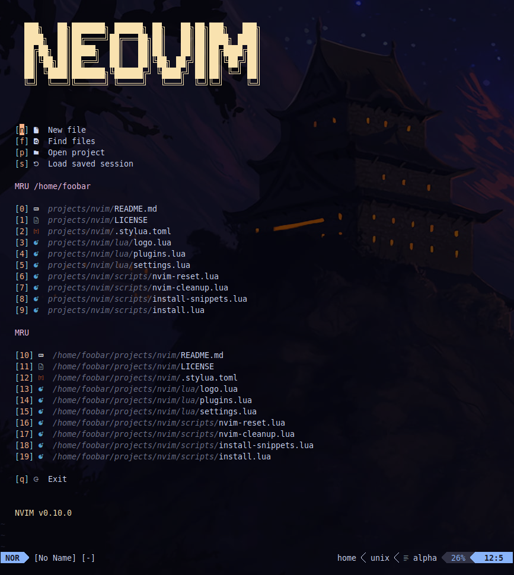

# Neovim config

[](https://github.com/1riz/nvim/actions/workflows/main.yml)
[](https://dotfyle.com/1riz/nvim)

minimalist Neovim config (< 500 lines).



## Plugins

- https://github.com/folke/lazy.nvim
- https://github.com/nvim-lualine/lualine.nvim
- https://github.com/nvim-tree/nvim-tree.lua
- https://github.com/nvim-tree/nvim-web-devicons
- https://github.com/nvim-telescope/telescope.nvim
- https://github.com/nvim-telescope/telescope-ui-select.nvim
- https://github.com/nvim-telescope/telescope-file-browser.nvim
- https://github.com/nvim-telescope/telescope-frecency.nvim
- https://github.com/1riz/telescope-macros.nvim
- https://github.com/Shatur/neovim-session-manager
- https://github.com/ahmedkhalf/project.nvim
- https://github.com/ThePrimeagen/harpoon
- https://github.com/gbprod/yanky.nvim
- https://github.com/gbprod/substitute.nvim
- https://github.com/nvim-pack/nvim-spectre
- https://github.com/sitiom/nvim-numbertoggle
- https://github.com/nvimdev/hlsearch.nvim
- https://github.com/goolord/alpha-nvim
- https://github.com/folke/which-key.nvim
- https://github.com/nvim-treesitter/nvim-treesitter
- https://github.com/nvim-treesitter/nvim-treesitter-textobjects
- https://github.com/neovim/nvim-lspconfig
- https://github.com/nvimtools/none-ls.nvim
- https://github.com/mfussenegger/nvim-dap
- https://github.com/theHamsta/nvim-dap-virtual-text
- https://github.com/folke/trouble.nvim
- https://github.com/olimorris/codecompanion.nvim
- https://github.com/L3MON4D3/LuaSnip
- https://github.com/honza/vim-snippets
- https://github.com/saadparwaiz1/cmp_luasnip
- https://github.com/hrsh7th/nvim-cmp
- https://github.com/windwp/nvim-autopairs
- https://github.com/kylechui/nvim-surround
- https://github.com/numToStr/Comment.nvim
- https://github.com/lewis6991/gitsigns.nvim
- https://github.com/lukas-reineke/indent-blankline.nvim
- https://github.com/MeanderingProgrammer/render-markdown.nvim

## Theme

- https://github.com/projekt0n/github-nvim-theme

## Installation

1) Remove current NVIM configuration and plugins

```bash
./scripts/nvim-reset.lua
```

2) Install this repository and the Lazy plugin manager

```bash
./scripts/install.lua
```

3) Install desired snippets

```bash
./scripts/install-snippets.lua bash sh lua c rust php
```

4) Execute NVIM to finish the installation

```bash
nvim
```

## Post-Installation

1) Update `.luarc.json` file  with your "$VIMRUNTIME"

```bash
nvim .config/nvim/.luarc.json
```

## Dependencies

### General

- neovim
- ripgrep

### Language specific (Optional)

**Lua**
- stylua
- lua-language-server

**Bash**
- shellcheck
- shfmt
- bash-language-server

**C**
- gdb
- astyle
- clangd

**Rust**
- rust-analizer
- rustfmt

**PHP**
- phpcs
- php-cs-fixer
- intelephense
